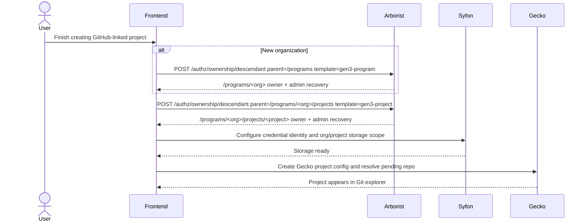

# GitHub-Style Descendant Ownership

## Summary

This branch adds an ownership materialization macro for creating missing
resources and granting the creator concrete Arborist access at the same time.
The goal is to support GitHub-style behavior in Calypr: if a user creates a new
organization or project, Arborist can expand that intent into the correct
resource, policy, role, and binding objects instead of requiring an
administrator to predefine every `/programs/<org>/projects/<project>` path in
static user YAML.

The feature does not replace Arborist's authorization model. Resources, roles,
policies, users, groups, and bindings remain the storage substrate. The new
endpoint is a semantic macro over those primitives: one request becomes a
consistent set of normal Arborist RBAC objects with provenance and safety
metadata.

## Problem

Classic Arborist assumes resources already exist before authorization decisions
are made. That works for static commons configuration, but it breaks dynamic
creation flows:

- A new GitHub repository is linked to Calypr before a Gecko project exists.
- Gecko needs to create `/programs/<org>/projects/<project>` for that repo.
- Syfon needs project-scoped storage access on the same authz path.
- The user creating the resource should get access by default.
- The system still needs administrator recovery access and protection against
orphaned resources.

Granting broad org-level access is too coarse. It allows project creation under
an org, but it also over-authorizes unrelated descendants. Asking every caller
to hand-assemble raw resources, policies, roles, and bindings is also too low
level for this feature. The desired operation is not "POST a policy"; it is
"create this missing child and materialize the inherited owner/admin access that
should exist for that child."

The new model creates only the immediate missing child requested by an explicit
template and then expands that creation into generated policies for the creator
and configured admin groups.

## Design Goals

- Keep normal `/auth/request` behavior unchanged.
- Authorize missing-resource creation only through a dedicated endpoint.
- Keep `create-descendant` immediate-child only.
- Treat the endpoint as a macro over existing RBAC objects, not a second
  authorization model.
- Represent resulting access as real Arborist policies and bindings.
- Make generated policies visible, auditable, and protected.
- Support multiple owners per generated resource.
- Prevent resources from losing both owner control and administrator recovery.
- Keep templates generic, while shipping Gen3 program/project templates first.

## New Authorization Primitive

`create-descendant` is a new permission method. It is intentionally evaluated
only by the ownership create workflow.

It is not a general authorization shortcut for missing paths. Existing-resource
authorization still goes through the normal Arborist auth model and standard
resource inheritance.

Semantics:

- A caller must have a policy with `service=arborist` and
  `method=create-descendant` on the exact parent path.
- The endpoint creates one immediate child under that parent.
- A grant on `/programs` can create `/programs/<org>`.
- A grant on `/programs/<org>/projects` can create
  `/programs/<org>/projects/<project>`.
- A grant on `/programs` does not directly create arbitrary projects under all
  organizations unless the caller first owns or otherwise has permission on the
  specific project container.

## Data Model Additions

The migration `2026-05-28T000000Z_descendant_ownership` adds three tables.

### `ownership_template`

Defines what kind of child can be created under what parent.

Important fields:

- `name`: template identifier used by API callers.
- `parent_path_pattern`: regex for valid parent paths.
- `child_kind`: descriptive child type.
- `child_container_name`: optional subresource created below the child.
- `owner_role`: role bound to generated owner policies.
- `admin_role`: role bound to protected admin policies.
- `default_admin_groups`: groups that receive protected recovery access.
- `delegable_roles`: roles owners are allowed to delegate through owner APIs.

Initial templates:

- `gen3-program`: parent `^/programs$`, creates `/programs/<org>` and child
  container `/programs/<org>/projects`.
- `gen3-project`: parent `^/programs/[^/]+/projects$`, creates a project under
  an existing program's project container.

### `generated_policy_metadata`

Marks policies created by this workflow.

Generated policies are normal Arborist policies, but this metadata tells generic
policy/resource APIs that the policy is internally generated and whether it is
protected from unsafe edits or deletes.

### `ownership_binding_metadata`

Records generated user/group bindings.

This stores the subject, target resource, template, binding kind, protection
flag, creator, timestamp, and JSON provenance. It lets Arborist distinguish:

- owner bindings
- delegated user bindings
- protected administrator recovery bindings

## Generated Roles And Policies

The workflow ensures the configured owner role exists. For the default `owner`
role, it ensures these permissions:

- `* / read`
- `* / create`
- `* / update`
- `* / write-storage`
- `* / read-storage`
- `arborist / create-descendant`
- `arborist / manage-owners`

Generated policy names are deterministic:

```text
generated.<kind>.<resource.path.with.dots>.<role>
```

Example:

```text
generated.owner.programs.Ellrott_Lab.projects.git_drs_test.owner
```

These are real policies and show up through policy list/read APIs with generated
metadata.

## API Surface

The routes are registered inside Arborist as `/ownership/*`. In Gen3 revproxy
they are exposed as `/authz/ownership/*`.

### Create Missing Descendant

```http
POST /ownership/descendant
```

Request:

```json
{
  "parent_path": "/programs/Ellrott_Lab/projects",
  "name": "git_drs_test",
  "template": "gen3-project",
  "description": "GitHub-linked Calypr project"
}
```

Behavior:

1. Decode the caller from the bearer token.
2. Verify `create-descendant` on `parent_path`.
3. Select an ownership template matching `parent_path` and optional `template`.
4. Reject if the child resource already exists.
5. In one transaction:
   - create the resource
   - optionally create the configured child container
   - ensure generated owner/admin roles and policies
   - bind the creator to the generated owner policy
   - bind protected admin recovery groups
   - record generated policy and binding provenance
6. Return the created resource and generated policy names.

Program creation example:

```json
{
  "parent_path": "/programs",
  "name": "Ellrott_Lab",
  "template": "gen3-program"
}
```

Project creation example:

```json
{
  "parent_path": "/programs/Ellrott_Lab/projects",
  "name": "git_drs_test",
  "template": "gen3-project"
}
```

### Add Owner

```http
POST /ownership/owner
```

Adds another owner binding for a generated resource. The caller must already
control ownership for that resource.

### Remove Owner

```http
DELETE /ownership/owner
```

Removes an owner binding. Arborist rejects the operation if it would leave the
resource without any owner and without protected admin recovery.

### Delegate User Access

```http
POST /ownership/user
DELETE /ownership/user
```

Adds or removes a non-admin generated user binding for a delegable role. The
role must be listed in the template's `delegable_roles`.

The initial Calypr project-creation wizard only calls
`POST /ownership/descendant`. The owner/user endpoints are intentionally present
for later collaborator management UI.

## Calypr Project Creation Flow



Submit order matters. Arborist comes first because Syfon and Gecko are scoped by
the authz resource that the new project needs. If Syfon succeeds but Gecko
fails, the project remains pending in Gecko and the frontend retries the Gecko
step without rolling back Arborist or Syfon.

## Safety Rules

Protected generated artifacts are intentionally hard to mutate through generic
APIs:

- Protected generated policies cannot be deleted.
- Protected generated policies cannot be overwritten.
- Resources with protected generated ownership cannot be deleted through the
  generic resource delete path.
- Owners cannot remove the last owner if no protected admin recovery binding
  remains.
- Owners cannot revoke protected administrator-derived access.

These rules are meant to keep self-service creation from producing resources
that no human or admin group can recover.

## Why An Ownership Macro Instead Of Only Raw Policy APIs?

The raw resource and policy APIs are still the underlying primitives. This
feature does not bypass them or introduce a second authorization model.

The ownership endpoint exists because "create this missing child and give the
creator the correct inherited ownership" is a semantic operation, not just a
collection of independent CRUD calls. It is the Arborist equivalent of a macro:
the caller provides intent, and Arborist expands that intent into concrete RBAC
objects in a controlled transaction.

Without this macro, every service that wants self-service project creation would
need to correctly sequence and validate all of the following:

- create the missing resource
- create or reuse the child container
- create deterministic owner/admin policies
- attach resources and roles to those policies
- bind the creator
- bind administrator recovery access
- record provenance
- protect generated policies from unsafe mutation
- avoid orphaned resources

That is possible with raw APIs, but it pushes policy materialization rules into
every caller. Over time, different callers would drift in policy names,
delegation rules, recovery bindings, and failure handling. The macro keeps that
logic inside Arborist, where the RBAC graph and invariants are defined.

This is especially useful for inheritance-style permissions. Creating a program
should make the creator capable of creating projects under that program, but it
should not grant global project creation everywhere. The macro can materialize
that shape as concrete policies:

- the user receives owner access on `/programs/<org>`
- the owner policy is also attached to `/programs/<org>/projects`
- the owner role includes `arborist/create-descendant`
- the next project creation is authorized on the immediate project container

Doing that correctly with raw APIs requires the caller to understand Arborist's
resource inheritance, policy-resource attachment behavior, role expansion, and
admin recovery expectations. The ownership macro makes that repeated pattern
explicit and reusable while still producing normal Arborist RBAC objects.

The dedicated transaction boundary lets Arborist enforce:

- missing-child authorization
- resource creation
- inheritance-shaped policy materialization
- generated policy naming
- owner binding
- admin recovery binding
- provenance recording
- protected mutation behavior

## Operational Notes

Migration required:

```bash
./migrations/latest
```

The migration seeds the initial `gen3-program` and `gen3-project` templates. If
deploying through Helm, ensure the image contains the latest migration directory
and the chart runs the usual migration path before serving traffic.

Required baseline authz:

- Users who may create new programs need `create-descendant` on `/programs`.
- Owners of `/programs/<org>` receive `create-descendant` on that org's
  generated `projects` container through the owner policy attached during
  program creation.
- Administrators remain protected recovery owners through the
  `administrators` group binding seeded by the template.

## Known Limits

- The v1 templates are generic in storage, but the seeded defaults are Gen3
  program/project oriented.
- Creation is immediate-child only by design.
- Existing-resource authorization behavior is unchanged.
- This does not grant GitHub repository access; it only materializes Arborist
  authz resources for Calypr services.
- The frontend currently orchestrates Arborist, Syfon, and Gecko. Arborist does
  not call those services server-side.

## Developer Checklist

When extending this feature:

- Add new resource creation shapes as `ownership_template` rows, not hardcoded
  path checks.
- Keep generated policies concrete and visible.
- Add structured provenance when new generated binding kinds are introduced.
- Do not let owner APIs mutate protected admin recovery bindings.
- Preserve the no-orphan invariant before deleting or removing ownership.
- Keep `/auth/request` semantics unchanged for missing resources.
