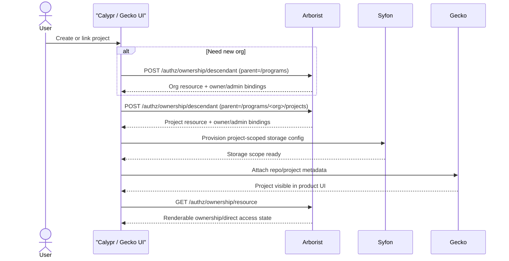

# GitHub Permissions Branch Overview

This document summarizes the Arborist changes on branch
`feature/github-permissions`.

The branch is not about GitHub repository ACL enforcement inside Arborist.
Instead, it adds the Arborist-side permission model needed for Calypr/Gecko to
support GitHub-linked project creation and ongoing org/project access
management without pre-materializing every project path in static config.

## Problem Statement

Before this branch, Arborist assumed that org and project resources already
existed and that operators would manage access by editing raw resources,
policies, groups, and user grants directly.

That breaks down for the Calypr product flow:

- a user creates or links a GitHub repository
- Gecko wants a matching Calypr org/project to appear
- Syfon wants the same org/project authz path for storage
- the creator should immediately have owner access
- admins still need recovery access
- product UIs need a safe way to add and remove project users later

The old model forced too much product logic outside Arborist. Clients had to
know how to synthesize and later mutate Arborist graph state safely.

## What This Branch Adds

The branch adds four connected capabilities:

1. Ownership-based descendant creation for missing org/project resources.
2. A narrow `create-descendant` permission for controlled self-service
   creation.
3. Ownership metadata and generated-policy metadata so Arborist can
   distinguish generated ownership state from legacy direct RBAC.
4. Direct access mutation macros so product clients can manage ordinary
   non-owner project access without editing raw policies.

## Mental Model

The easiest way to read this branch is:

- `/ownership/descendant` creates missing resources and materializes the
  expected owner/admin bindings.
- `/ownership/owner` manages owners.
- `/ownership/resource` reads the effective ownership and direct access state
  that UI pages need to render.
- `/access/user` handles normal direct user role add/remove for existing
  resources.

These are macros over normal Arborist RBAC primitives. They do not replace the
existing resource, role, policy, group, or user model.

## GitHub And Gecko Scope

The "GitHub permissions" name is product shorthand.

What Arborist actually owns in this branch is:

- creating the org/project authz resources that a GitHub-linked project needs
- granting the creator project control
- granting configured admin recovery access
- allowing controlled org-member project creation
- exposing a safe read/mutate surface for project settings UIs

What Arborist does not own:

- GitHub repository membership
- GitHub team synchronization
- Gecko repository import state
- Syfon storage provisioning

Those systems consume the Arborist resource path and permissions model, but
Arborist is only the authz source of truth.

## Main API Additions

### `POST /ownership/descendant`

Creates one immediate missing child under an allowed parent and materializes
generated policies and bindings for that child.

Used for:

- creating `/programs/<org>`
- creating `/programs/<org>/projects/<project>`

### `POST /ownership/owner`
### `DELETE /ownership/owner`

Adds or removes explicit owners for a generated resource.

### `GET /ownership/resource`

Returns the binding view that product UIs need to render current owners,
direct grants, group-derived grants, and protected admin rows.

### `POST /access/user`
### `DELETE /access/user`

RBAC-shaped direct access macros for ordinary non-owner user management on an
existing resource.

## New Permission Model Pieces

### `create-descendant`

This new Arborist method is only for the ownership create workflow.

It allows a caller with the right parent-scoped permission to create exactly
one immediate child resource. It is intentionally narrower than broad org-level
write access.

### `org-member`

This branch introduces the `org-member` role for a common product case:

- user may create projects inside an existing org
- user should not automatically get broad rights over sibling projects

That role delegates only the ability needed for project creation at the org's
project container.

## Metadata Added By This Branch

The branch adds metadata tables so Arborist can tell generated graph state from
legacy direct RBAC:

- `ownership_template`
- `generated_policy_metadata`
- `ownership_binding_metadata`

That metadata is what makes the higher-level APIs safe. Arborist can answer:

- is this row owner access, direct access, or admin recovery?
- is this policy protected?
- can this grant be safely removed as-is?
- is this request trying to mutate inherited or group-derived access?

## Why The Read Path Matters

One of the most important changes in this branch is not just mutation, but
classification.

`GET /ownership/resource` gives product clients a normalized view over mixed
grant sources:

- generated owner bindings
- direct user-policy grants
- group-derived grants
- inherited ancestor grants
- protected admin bindings

Without that endpoint, the UI would need Arborist-internal graph knowledge to
explain why a user appears to have access and whether that access is removable.

## Why `/access/user` Exists

This branch deliberately keeps ordinary project access changes in Arborist.

That logic does not belong in Gecko, Requestor, or the frontend because only
Arborist can safely decide whether a requested removal is:

- an exact direct user grant
- an inherited ancestor grant
- a group grant
- a protected generated binding
- a broad policy that must not be split implicitly

The API contract is therefore intent-based:

- caller supplies `resource_path`, `username`, and `role_id`
- Arborist decides whether it can safely grant, remove, or reject

## End-To-End Product Flow

## Branch Invariants

This branch is trying to preserve these invariants:

- self-service project creation should produce real Arborist graph state
- project creators should immediately control the project they created
- admins should retain recovery access
- project access UIs should not mutate raw policies directly
- inherited or group-derived access should not be silently rewritten
- broad direct policies should not be split implicitly during a revoke

## Where To Read Next

- [descendant_ownership.md](descendant_ownership.md) for missing-resource
  creation and owner/admin materialization
- [access_mutation_macros.md](access_mutation_macros.md) for direct user access
  add/remove behavior

## Implementation Touchpoints

The main code paths for this branch are:

- `internal/ownership/ownership.go`
- `internal/ownership/ownership_templates.go`
- `internal/ownership/ownership_bindings.go`
- `internal/httpapi/ownership_read.go`
- `internal/access/access.go`
- `internal/httpapi/access_handlers.go`
- `internal/httpapi/ownership_auth.go`
- `internal/authz/auth_epoch.go`
- `internal/authz/auth_epoch_cache.go`
