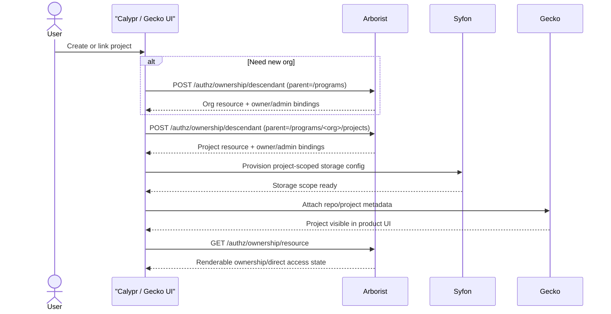
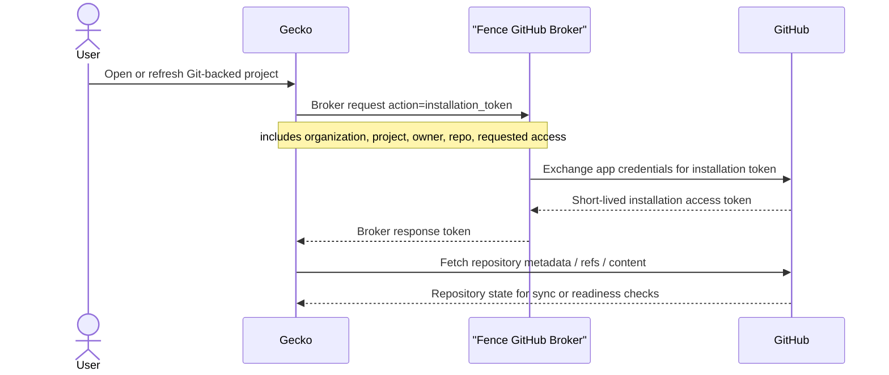

# GitHub Permissions Branch Overview

This document summarizes the Arborist changes on branch
`feature/github-permissions`.

The branch is not about GitHub repository ACL enforcement inside Arborist.
Instead, it adds the Arborist-side permission model needed for Calypr/Gecko to
support GitHub-linked project creation and ongoing org/project access
management without pre-materializing every project path in static config.

## Problem Statement

Before this branch, Arborist assumed that org and project resources already
existed and that operators would manage access by editing raw resources,
policies, groups, and user grants directly.

That breaks down for the Calypr product flow:

- a user creates or links a GitHub repository
- Gecko wants a matching Calypr org/project to appear
- Syfon wants the same org/project authz path for storage
- the creator should immediately have owner access
- admins still need recovery access
- product UIs need a safe way to add and remove project users later

The old model forced too much product logic outside Arborist. Clients had to
know how to synthesize and later mutate Arborist graph state safely.

## What This Branch Adds

The branch adds four connected capabilities:

1. Ownership-based descendant creation for missing org/project resources.
2. A narrow `create-descendant` permission for controlled self-service
   creation.
3. Ownership metadata and generated-policy metadata so Arborist can
   distinguish generated ownership state from legacy direct RBAC.
4. Direct access mutation macros so product clients can manage ordinary
   non-owner project access without editing raw policies.

## Why This PR Is Large

This branch is a large Arborist PR for two different reasons that stack on top
of each other:

1. It adds genuinely new product-facing authorization behavior.
2. It also continues the package/server split needed to keep that behavior from
   landing as one more layer inside the old monolithic server code.

The size increase is not just "more endpoints." The branch adds:

- descendant-creation semantics
- ownership materialization logic
- direct-access mutation logic
- read-side classification over mixed grant provenance
- ownership metadata tables and migrations
- authz epoch invalidation for the new mutation paths
- new tests and branch-specific docs

At the same time, the branch moves Arborist further away from the old
single-package layout and into explicit internal packages for authz core,
authorization engine, ownership, access, and HTTP handlers.

That means a big diff here represents both feature work and architecture work:

- feature work because Calypr/Gecko needs a new control-plane API
- architecture work because that API would be hard to reason about if it were
  bolted onto the old `arborist/server.go` shape

The practical justification for the size is that the product flow needs
Arborist to do more than answer yes/no auth checks. Arborist now has to safely
materialize, classify, and mutate authorization graph state for dynamic
projects. If that logic were spread across Gecko, the frontend, and ad hoc raw
policy calls, the code would be smaller in this repo but the system would be
more fragile overall.

## Where The Size Went

A useful way to read the growth is by subsystem, not by file count.

### 1. Ownership Creation And Lifecycle

This is the code that turns "create an org/project authz resource" into real
Arborist graph state with owner/admin bindings and deletion rules.

Main files:

- `internal/ownership/service.go`
- `internal/ownership/ownership.go`
- `internal/ownership/ownership_templates.go`
- `internal/ownership/ownership_bindings.go`

### 2. Access Mutation Macros

This is the code that lets product clients express direct user access intent as
`resource_path + username + role_id` without directly editing policies.

Main files:

- `internal/access/access.go`
- `internal/httpapi/access_handlers.go`

### 3. Read-Side Classification

This is the code that explains effective access back to the UI in a form that
distinguishes owner, direct, inherited, group-derived, and protected rows.

Main files:

- `internal/ownership/read.go`
- `internal/httpapi/ownership_handlers.go`

### 4. Authorization Engine And Cache Plumbing

This is the supporting layer that lets the new ownership and access mutations
re-check permissions and invalidate cached authz state safely.

Main files:

- `internal/authz/engine/authorize.go`
- `internal/authz/engine/mapping.go`
- `internal/authz/engine/request.go`
- `internal/authz/engine/resources.go`
- `internal/authz/epoch/auth_epoch_cache.go`

### 5. HTTP Server Split

This is structural work. Arborist used to carry much more of its server logic
inside the old top-level package layout. This branch keeps moving that code
into dedicated internal packages and handler files so the new behavior has
clear ownership boundaries.

Main files:

- `internal/httpapi/server.go`
- `internal/httpapi/auth_handlers.go`
- `internal/httpapi/catalog_handlers.go`
- `internal/httpapi/principal_handlers.go`
- `internal/httpapi/response.go`

### 6. Schema And Documentation

This branch is not safe to understand from handlers alone. The metadata tables,
roles, and invariants are part of the feature, so migrations and docs are
first-class pieces of the change.

Main files:

- `migrations/2026-05-28T000000Z_descendant_ownership/*`
- `migrations/2026-06-01T000000Z_org_member_role/*`
- `migrations/2026-06-01T020000Z_ownership_base_roles/*`
- `migrations/2026-06-02T000000Z_logged_in_program_creator/*`
- `docs/descendant_ownership.md`
- `docs/access_mutation_macros.md`
- `docs/github_permissions.md`

## Mental Model

The easiest way to read this branch is:

- `/ownership/descendant` creates missing resources and materializes the
  expected owner/admin bindings.
- `/ownership/owner` manages owners.
- `/ownership/resource` reads the effective ownership and direct access state
  that UI pages need to render.
- `/access/user` handles normal direct user role add/remove for existing
  resources.

These are macros over normal Arborist RBAC primitives. They do not replace the
existing resource, role, policy, group, or user model.

Another way to say this: the branch makes Arborist responsible for a dynamic
authorization control plane, not just a static policy store and auth checker.

## GitHub And Gecko Scope

The "GitHub permissions" name is product shorthand.

What Arborist actually owns in this branch is:

- creating the org/project authz resources that a GitHub-linked project needs
- granting the creator project control
- granting configured admin recovery access
- allowing controlled org-member project creation
- exposing a safe read/mutate surface for project settings UIs

What Arborist does not own:

- GitHub repository membership
- GitHub team synchronization
- Gecko repository import state
- Syfon storage provisioning

Those systems consume the Arborist resource path and permissions model, but
Arborist is only the authz source of truth.

## Current Consumers

At the time of this branch snapshot, the live consumers break down like this:

- Gecko uses descendant creation and ownership resource deletion during
  org/project setup and teardown.
- The frontend GitExplorer settings UI uses ownership reads plus
  owner/direct-access mutation macros to render and manage org/project people.
- Fence is the authz/token boundary and userinfo snapshot source; it is not the
  product caller for these ownership mutation routes.

The audit result for this branch was:

- the new Arborist ownership and access routes are all exercised by current
  Gecko and frontend flows
- the stale surface was not an extra Arborist handler, but older shared
  frontend client hooks that still referenced `/ownership/user`
- cleanup in Arborist therefore focused on clarifying package boundaries rather
  than deleting live HTTP endpoints

## Why This Logic Lives In Arborist

This branch deliberately grows Arborist instead of teaching Gecko or the
frontend how to perform raw policy surgery.

That is intentional because Arborist is the only place that already knows:

- how resources inherit
- how roles and policies compose
- which bindings are generated or protected
- when a revoke request would require splitting a broad policy
- when an apparent grant is actually inherited or group-derived
- how to invalidate authz snapshots after mutation

Putting that logic elsewhere would shrink this PR only by moving the same
complexity into worse locations.

If Gecko owned it:

- Gecko would need Arborist graph semantics, policy naming rules, and safety
  checks duplicated in application code.

If the frontend owned it:

- browser code would need Arborist provenance knowledge and would become
  tightly coupled to internal storage shape.

If operators used only raw policy APIs:

- every product flow would need to hand-assemble the same sequence of resource,
  policy, role, and binding mutations with no single invariant-enforcing macro.

The branch is therefore large because it chooses a first-class implementation
in the authz source of truth, not a smaller but leaky workaround in callers.

## Main API Additions

The internal Arborist routes are registered under `/ownership/*` and
`/access/*`. In deployed Gen3/Calypr flows, browser and Gecko callers normally
reach them through revproxy as `/authz/ownership/*` and `/authz/access/*`.

The important distinction for this PR is:

- Arborist owns authz resource creation, owner management, access mutation, and
  ownership/access reads.
- Fence owns the GitHub broker flow Gecko uses to look up installation status,
  repository visibility, and short-lived GitHub installation tokens.

### `POST /ownership/descendant`

External route normally used by callers:

- `POST /authz/ownership/descendant`

Creates one immediate missing child under an allowed parent and materializes
generated policies and bindings for that child.

Used for:

- creating `/programs/<org>`
- creating `/programs/<org>/projects/<project>`
- letting Gecko-backed project initialization create missing Arborist resources
  instead of assuming they were pre-seeded out of band

Request shape:

- `parent_path`
- `name`
- optional `template`
- optional `description`

Authorization rule:

- caller must already have `arborist/create-descendant` on the exact
  `parent_path`

### `POST /ownership/owner`
### `DELETE /ownership/owner`

External routes normally used by callers:

- `POST /authz/ownership/owner`
- `DELETE /authz/ownership/owner`

Adds or removes explicit owners for a generated resource.

Current caller shape:

- GitExplorer settings uses these routes for organization-owner and
  project-owner changes
- Gecko setup does not use these routes during initial project creation because
  descendant creation already materializes creator ownership

### `GET /ownership/resource`

External route normally used by callers:

- `GET /authz/ownership/resource`

Returns the binding view that product UIs need to render current owners,
direct grants, group-derived grants, and protected admin rows.

Important query parameters:

- `resource_path`
- optional `include_children`
- optional `include_admins`

Current caller shape:

- GitExplorer settings uses this read path to render org owners, org members,
  project owners, direct project access, inherited rows, and protected admin
  rows without knowing Arborist’s internal graph layout

### `POST /access/user`
### `DELETE /access/user`

External routes normally used by callers:

- `POST /authz/access/user`
- `DELETE /authz/access/user`

RBAC-shaped direct access macros for ordinary non-owner user management on an
existing resource.

Request shape:

- `resource_path`
- `username`
- `role_id`

Current caller shape:

- GitExplorer settings uses these routes for direct org-member and project
  reader/writer style role changes
- these routes are intentionally not used for owner changes
- these routes are intentionally not used for GitHub API token exchange

### What Is Not An Arborist Route

This branch also depends on Gecko being able to obtain GitHub installation
tokens, but that flow does not go through Arborist.

Gecko currently asks Fence’s GitHub broker for:

- organization installation status
- repository installation status
- installation repository lists
- installation tokens

That is separate from the Arborist ownership/access API. Arborist’s role in the
overall Git flow is to ensure the authz resource graph and authorization model
exist before Gecko and Syfon continue.

## New Permission Model Pieces

### `create-descendant`

This new Arborist method is only for the ownership create workflow.

It allows a caller with the right parent-scoped permission to create exactly
one immediate child resource. It is intentionally narrower than broad org-level
write access.

### `org-member`

This branch introduces the `org-member` role for a common product case:

- user may create projects inside an existing org
- user should not automatically get broad rights over sibling projects

That role delegates only the ability needed for project creation at the org's
project container.

## Metadata Added By This Branch

The branch adds metadata tables so Arborist can tell generated graph state from
legacy direct RBAC:

- `ownership_template`
- `generated_policy_metadata`
- `ownership_binding_metadata`

That metadata is what makes the higher-level APIs safe. Arborist can answer:

- is this row owner access, direct access, or admin recovery?
- is this policy protected?
- can this grant be safely removed as-is?
- is this request trying to mutate inherited or group-derived access?

## Why The Read Path Matters

One of the most important changes in this branch is not just mutation, but
classification.

`GET /ownership/resource` gives product clients a normalized view over mixed
grant sources:

- generated owner bindings
- direct user-policy grants
- group-derived grants
- inherited ancestor grants
- protected admin bindings

Without that endpoint, the UI would need Arborist-internal graph knowledge to
explain why a user appears to have access and whether that access is removable.

## Why `/access/user` Exists

This branch deliberately keeps ordinary project access changes in Arborist.

That logic does not belong in Gecko, Requestor, or the frontend because only
Arborist can safely decide whether a requested removal is:

- an exact direct user grant
- an inherited ancestor grant
- a group grant
- a protected generated binding
- a broad policy that must not be split implicitly

The API contract is therefore intent-based:

- caller supplies `resource_path`, `username`, and `role_id`
- Arborist decides whether it can safely grant, remove, or reject

## End-To-End Product Flow

## Gecko GitHub Token Flow

This branch’s "GitHub permissions" product story also depends on Gecko being
able to talk to the GitHub API for repository checks and sync operations. That
token flow is brokered by Fence, not Arborist.

That sequence is adjacent to this Arborist PR, but the token exchange itself is
not implemented inside Arborist. The reason it appears in this overview is that
the project setup flow only works when both halves are present:

- Arborist materializes the org/project authz graph
- Fence brokers GitHub installation access for Gecko

## Branch Invariants

This branch is trying to preserve these invariants:

- self-service project creation should produce real Arborist graph state
- project creators should immediately control the project they created
- admins should retain recovery access
- project access UIs should not mutate raw policies directly
- inherited or group-derived access should not be silently rewritten
- broad direct policies should not be split implicitly during a revoke
- the same org/project intent should materialize the same concrete Arborist
  graph shape regardless of which product caller triggered it
- ownership and direct-access APIs should remain semantic macros over normal
  RBAC state, not a parallel hidden authorization model

## Where To Read Next

- [descendant_ownership.md](descendant_ownership.md) for missing-resource
  creation and owner/admin materialization
- [access_mutation_macros.md](access_mutation_macros.md) for direct user access
  add/remove behavior

## Implementation Touchpoints

The main code paths for this branch are:

- `internal/ownership/ownership.go`
- `internal/ownership/service.go`
- `internal/ownership/ownership_templates.go`
- `internal/ownership/ownership_bindings.go`
- `internal/ownership/read.go`
- `internal/httpapi/ownership_handlers.go`
- `internal/access/access.go`
- `internal/httpapi/access_handlers.go`
- `internal/httpapi/server.go`
- `internal/authz/engine/authorize.go`
- `internal/authz/auth_epoch_cache.go`

The highest-level reading order for reviewers is:

1. `docs/github_permissions.md`
2. `docs/descendant_ownership.md`
3. `docs/access_mutation_macros.md`
4. `internal/ownership/service.go`
5. `internal/access/access.go`
6. `internal/httpapi/ownership_handlers.go`
7. `internal/httpapi/access_handlers.go`
